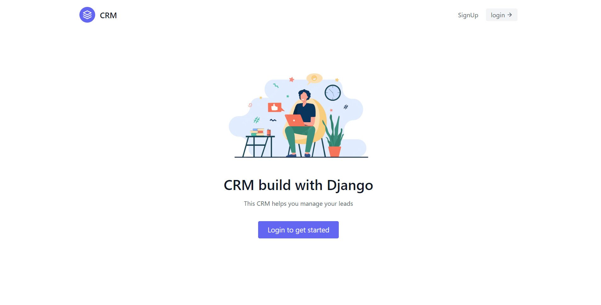

# Django CRM Project - Contact Management Project

## Description
- Customer relationship management (CRM) is a technology for managing all your company’s relationships and interactions with customers and potential customers. The    goal is simple: Improve business relationships. A CRM system helps companies stay connected to customers, streamline processes, and improve profitability.

## ER Diagram

## Screenshots

<table>
  <tr>
  <td align="center">
      
       
      
Login Page

    </td>
    <td align="center">
      
       
      
Create Leads

    </td>
    <td align="center">
    
       
      
Leads

    </td>
    <td align="center">
      
       
      
Agent

    </td>
    <td align="center">
      
       
      
Agent Update

    </td>
    </tr>
</table>
